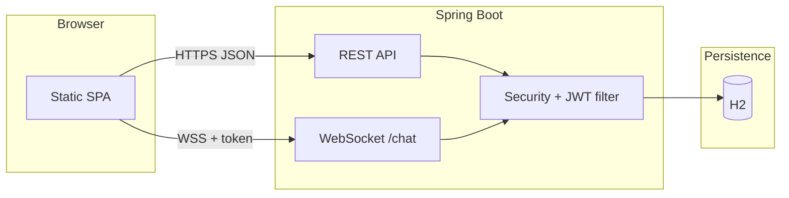

# Aurora

**Team chat that feels instant.** A production-minded reference implementation of real-time messaging with channels, JWT auth, and a polished single-page client—built to demonstrate how modern collaboration tools wire REST, WebSockets, and persistence together without unnecessary complexity.

---

## Why Aurora exists

Most “chat demos” stop at broadcasting strings over a socket. Real products need **identity**, **rooms (channels)**, **history**, and **resilience** when the network flakes. Aurora was built to show that full loop in one cohesive codebase: sign up, join channels, share deep links, and keep talking when the connection drops—so reviewers can see **system design**, **UX judgment**, and **shipping discipline** in one place.

---

## What you get

| Area | Details |
|------|---------|
| **Product** | Multi-channel workspace, Slack-style shell, onboarding tour, light/dark theme |
| **Auth** | Register / login, JWT in `sessionStorage` (tab-scoped), protected APIs |
| **Real time** | WebSocket chat + typing indicators, scoped per `channelId` |
| **Data** | JPA entities, H2 file DB (dev), message history per channel, default `#general` |
| **UX** | Channel filter & shortcuts, `?channel=<slug>` deep links, copy link, reconnect + failed-send retry |

---

## Architecture



- **REST** handles auth, channel CRUD, and paginated message history (`channelId` required).
- **WebSocket** handshake requires a valid JWT **and** an existing channel id—messages are persisted and broadcast within that channel only.
- **Client** is vanilla JS + CSS (no build step) served from `classpath:/static`—fast to iterate and easy to deploy behind the same JAR.

---

## How it’s built (design choices)

1. **Channels as first-class entities** — Isolates history and live traffic by domain; avoids a single global room that doesn’t scale conceptually or operationally.
2. **JWT for API + WS** — One auth story: stateless HTTP, same token on the socket query string (demo-appropriate; production would also consider cookie-based WS or ticket exchange).
3. **Session in `sessionStorage`** — Clear security story for a demo: credentials don’t survive closing the tab; no silent cross-tab leakage.
4. **Reconnect + send queue** — Product-grade behavior: transient disconnects shouldn’t lose the user’s last message intent.
5. **H2 file DB in dev** — Zero external services to run; swap URL + dialect for PostgreSQL when you’re ready.

---

## Quick start

**Prerequisites:** Java 17+, Maven 3.9+

```bash
cd web-chat
mvn spring-boot:run
```

Open **[http://localhost:8080](http://localhost:8080)** — register, then use channels and chat.

**Run tests:**

```bash
cd web-chat
mvn test
```

---

## Production checklist (not implemented here)

- Strong `jwt.secret` from a secret manager; HTTPS everywhere; WSS only.
- PostgreSQL (or managed SQL), backups, and migration strategy (Flyway/Liquibase).
- Rate limiting on auth; WebSocket connection limits; observability (metrics/tracing).
- Optional: Redis for presence/typing at scale; full-text search for messages.

---

*Aurora — built to be understood, extended, and demoed with confidence.*
